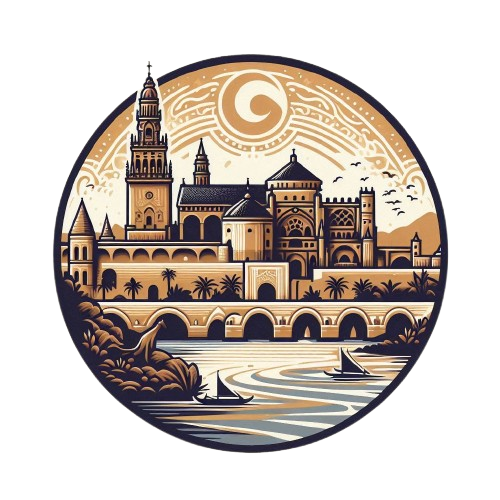

# 
Hi!, I'm Saúl Ruiz  

 

###  About me
<picture> </picture>
- 💻 **1st year ASIR (Computer Network Systems Administration) student** at IES Gran Capitán in Córdoba, committed to becoming an expert in cybersecurity
- 🔒 **Interested in Red Team**, focusing on the protection of critical systems and data
- 🌍 **Languages**: Native Spanish Speaker, B2 in English (Trinity certification) and in French, thanks to my experience in the Bachibac program
- 🌱 **Focused on professional and personal growth**, seeking to continuously learn and apply new knowledge
- 🤝 **Motivated to network** with cybersecurity professionals, eager to learn from their experiences and share knowledge
- 🎯 **Committed to certifying my knowledge** and taking on significant responsibilities in the field of digital security

 

###  Skills
  
-  **Front-End Development:**

     
     

-  **Softwares and Tools:**
  
    

     
     
     
     
    

-   **Operating Systems:**

    
    
    
    
    

 

### Highlighted projects
<table>
<tr>
<td width="50%">
<h3 align="center">Córdoba Patrimonio</h3>

</a> 

This website is part of a <b>year-long</b> project at my <b>High School</b> and is dedicated to highlighting the <b>rich history and culture of Cordoba</b>, a city that is a true <b>world heritage</b> treasure. Through this platform, I have created a space where visitors can explore the iconic monuments, <b>local traditions</b>, and cultural events that make Cordoba unique.

 

### <b> Github Stats </b>
 

