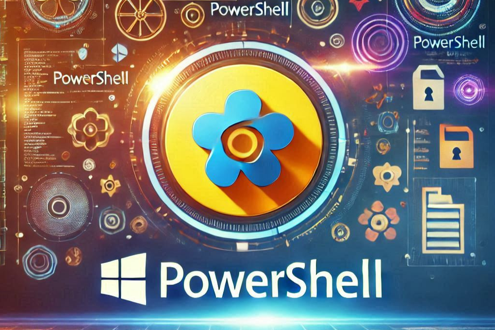
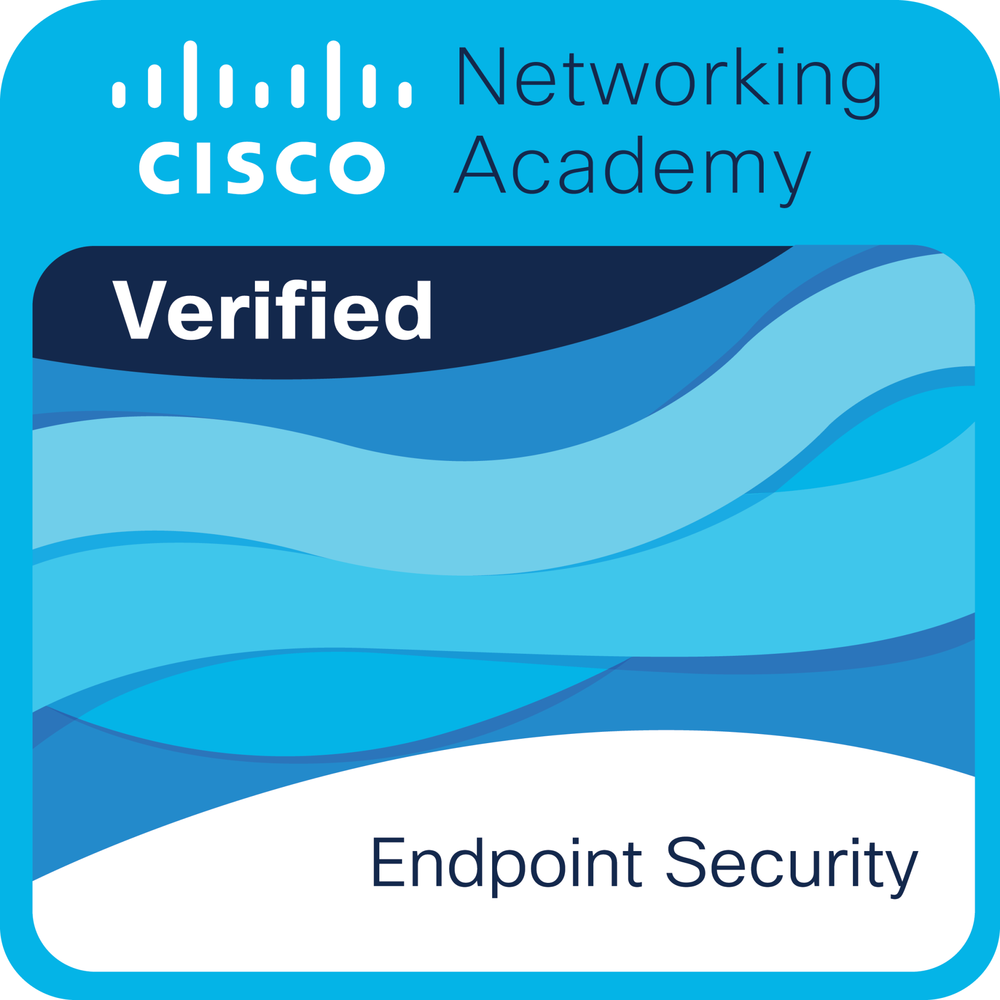
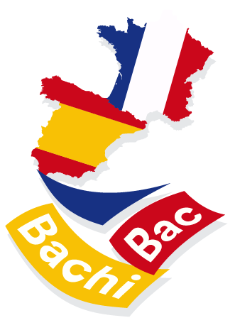

<h1>Hi! I'm Saúl Ruiz </h1>
 

##  About me 
<picture> </picture>

I am a second-year student in Computer Network Systems Administration with a strong interest in cybersecurity, especially in the Red Team area. Since I was a child, I have always been interested in the world of computing and I spent part of my free time experimenting with the devices in my home.

Besides computing, I have passion for languages. This led me to take the French-Spanish Bachibac double bachelor's degree, obtaining a B2 level in English and French. I am currently improving my skills to achieve the C1 level.  

I am known for my discipline and self-learning, which makes me adapt to new environments and face challenges with motivation.  I I also have a special talent for synthesising information. I also have a capacity for synthesising information and enjoy sharing my knowledge through my personal project, PlaSysX, which it is focuses on solving and teaching computer science problems.  

My goal is to continue growing in the sector, attain positions of high responsibility in cybersecurity, and bring value to as many people as possible. I want to learn from the people I meet during my professional career, who inspire me and push me to improve.

##  Check out my social media

##  Skills

### ⚙️ Systems & Networking  
  

 

---

### 🗄️ Databases & Development  
 
     
  
 

---

### 🔐 Cybersecurity & Tools  
 

   
     

## Highlighted projects
<table>
<tr>
<td width="50%">
<h3 align="center">PowerShell</h3>

</a> <a href="https://github.com/saulruizplaza/PowerShell" target="_blank">

This resource set includes practical PowerShell exercises to <strong>improve programming and automation skills</strong>. Each exercise has a <strong> description and a solution</strong>, covering topics like variables, operators, and control structures. It is perfect to learn and practice PowerShell step by step.

---
<table>
<tr>
<td width="50%">
<h3 align="center">Córdoba Patrimonio</h3>

</a>

This website is part of a <b>year-long</b> project at my <b>High School</b> and is dedicated to highlighting the <b>rich history and culture of Cordoba</b>, a city that is a true <b>world heritage</b> treasure. Through this platform, I have created a space where visitors can explore the iconic monuments, <b>local traditions</b>, and cultural events that make Cordoba unique.

## Certificates

<table style="width=90%">
  <tr>
    <td>
      
    </td>
    <td>
    <a href="./img/bac.pdf">
    
    </td>
  </tr>
  <tr>
    <td>
      
    </td>
    <td>
          
    </td>
  </tr>
</table>

##  Contact

