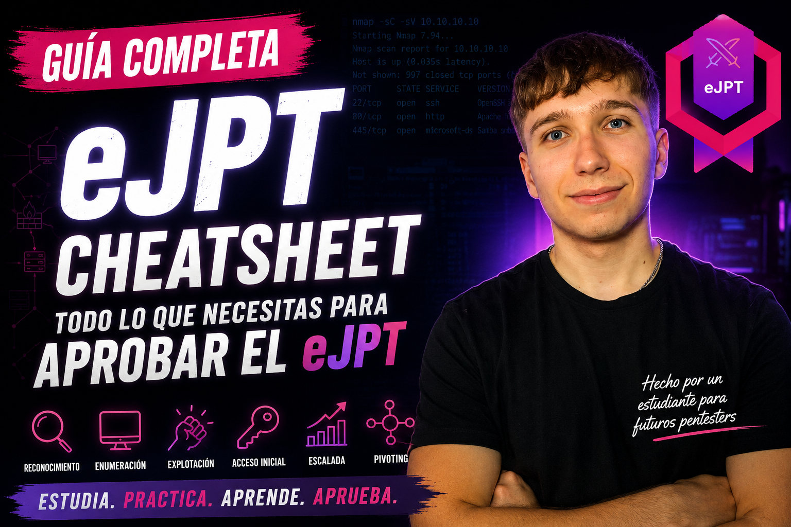
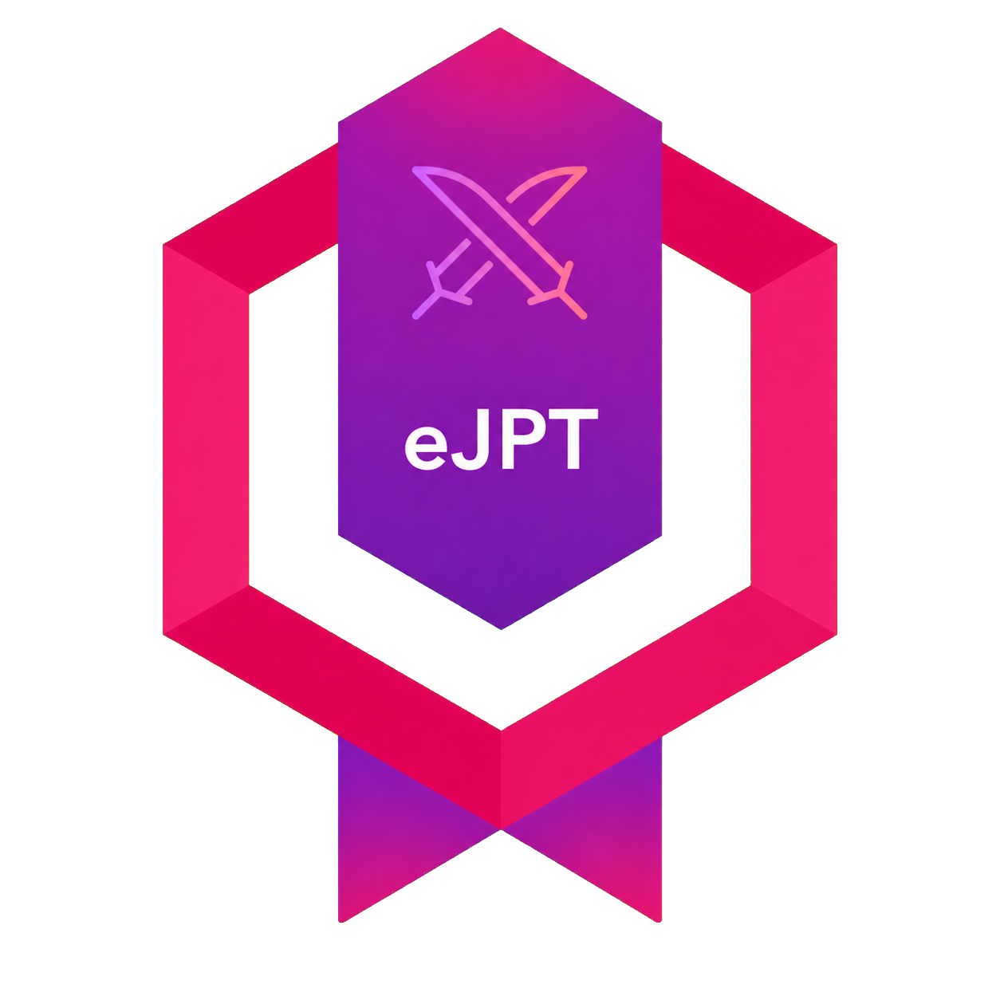
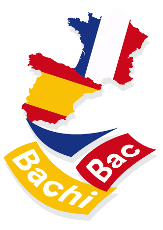

<h1>Hi! I'm Saúl Ruiz </h1>

  
  
  

---

##  About me

<picture>
  
</picture>

I'm **Saúl Ruiz Plaza**, a cybersecurity analyst focused on **pentesting, offensive security and technical analysis**.

I like understanding how systems work internally, testing things, breaking them in controlled environments and documenting what I learn along the way. That's why I usually work on labs, write-ups and projects where I practice **enumeration, exploitation, privilege escalation and web security**.

My SOC experience has also helped me a lot, because it allows me to see cybersecurity from both sides: how threats are detected and how an attacker may think.

I use **PlaSysX** as my personal brand to share projects, technical content and everything I'm building within the cybersecurity world.

---

##  Check out my social media

---

##  Skills

### ⚙️ Systems & Networking  

---

### 🗄️ Databases & Development  

---

### 🔐 Cybersecurity & Tools  

---

##  Highlighted projects

<table>
<tr>
<td>
<h3 align="center">Cybersecurity WriteUps</h3>

  

  This repository contains a collection of <strong>cybersecurity write-ups</strong> from platforms such as <strong>DockerLabs</strong>, <strong>Hack The Box</strong>, <strong>TryHackMe</strong>, and others.

  The write-ups are organized by <strong>platform and difficulty</strong>, with clear explanations, screenshots, and the commands used in each step.

  The repository is <strong>regularly updated</strong> as part of my learning process in offensive cybersecurity.

</td>
</tr>

<tr>
<td>
<h3 align="center">eJPT Cheatsheet</h3>

  

  A practical <strong>eJPT preparation repository</strong> with notes, commands, methodology and resources focused on real pentesting practice.

  It includes key topics such as <strong>reconnaissance</strong>, <strong>enumeration</strong>, <strong>exploitation</strong>, <strong>initial access</strong>, <strong>privilege escalation</strong> and <strong>pivoting</strong>.

  Built to help students practice, understand the methodology and prepare for the <strong>eJPT certification</strong> in a clear and structured way.

</td>
</tr>
</table>

---

##  Certificates

<table>
  <tr>
    <td>
      
    </td>
    <td>
      
    </td>
    <td>
      
    </td>
  </tr>
  <tr>
    <td>
      
    </td>
    <td>
      
    </td>
  </tr>
</table>

##  Contact

